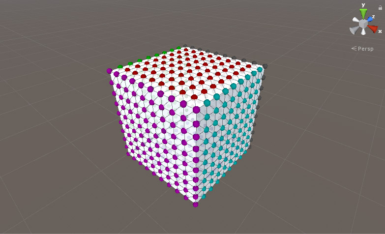
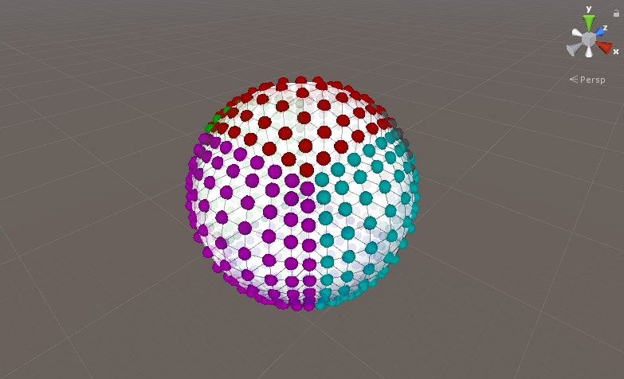
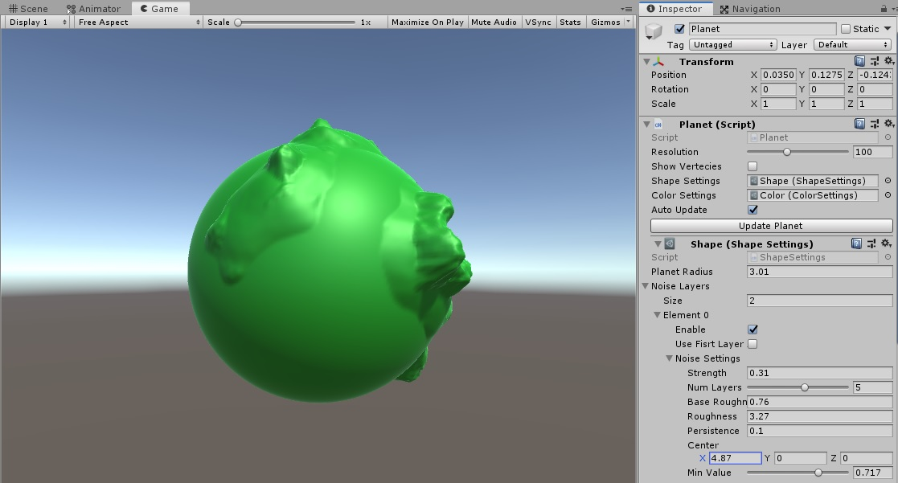
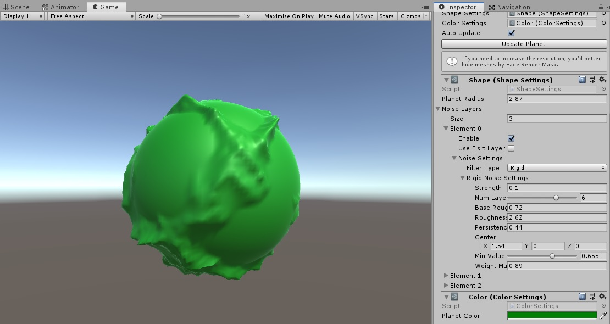
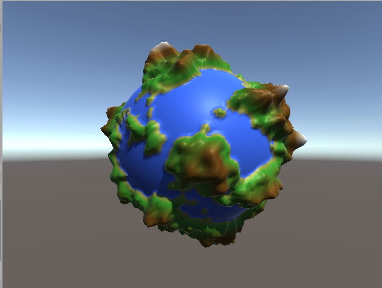

# Procedural Planets

This project starts from creating a circular planet with mountains, alleys and oceans and ends with setting color and gradient overlays. The total processes of creating the planet and the shader are at your hands, to setup and create your own planet as you wish.

### Images
First 3D mesh generation attempt

Planet mesh generation

Shape and Color settings added

Noise-based deformation (Simple Noise)

Noise-based deformation (Rigid Noise)

Shader added

Biomes added

Ocean shader added

### Technical Info
The planet is made of six 2D planes, facing out on the six axis. The resolution can be set between, minimum 2 and maximum 256 vertecis (on each dimension of each plane).

Each planet has it's own features which are placed in `Shape Settings` and `Color Settings` (they can be created as seperate `asset`);

- Shape Settings
	- Planet radius
	- Noise layers with lots of properties

- Color Settings:
	- This project uses `Light Weight Pipeline` and `PBR (Physically Based Rendering) Shader` ([video](https://www.youtube.com/watch?v=_LaVvGlkBDs)) to calculate the UV and finally colors, based on the points position on the planet's surface.
	- Unlimited number os biomes (for defining different regions/environments)
	- Ocean
	- Option for blending the different biomes

### Features
- Dynamic mesh generation
- Noise-based mesh deformation
- Editor programming
- Dynamic material generaion
- UV-based material seperation

### Others
With special thanks to [Sebastian Lague](https://www.youtube.com/watch?v=QN39W020LqU&list=PLFt_AvWsXl0cONs3T0By4puYy6GM22ko8)